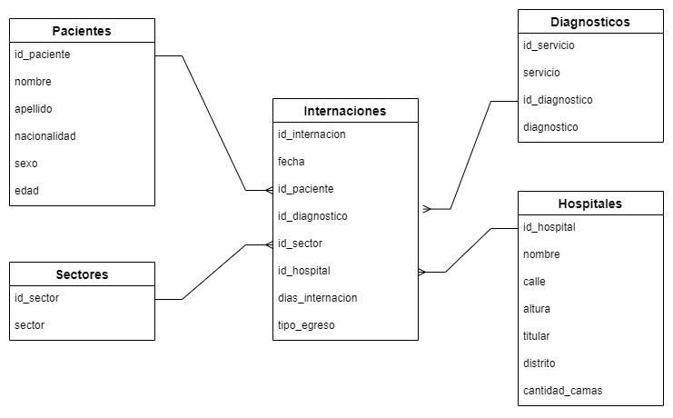

# Laboratorio SQL - Análisis de Salud Pública Rosario

Ejercicios prácticos de SQL realizados en Databricks utilizando datos reales de salud pública de la Ciudad de Rosario.

## 📊 Dataset
- **Fuente**: Datos Rosario - Salud Pública. [Link: Datos Rosario](https://datos.rosario.gob.ar/)
- **Período**: 2019-2022
- **Tablas**: Pacientes, Hospitales, Diagnósticos, Sectores, Internaciones

## 📁 Contenido
- `Dia1.sql` - **SQL Básico**: Exploración, agrupaciones, funciones de agregación y texto, manejo de NULL, CASE y JOINs básicos
- `Dia2.sql` - **JOINs Avanzados**: Todos los tipos de JOIN, COALESCE, CAST y consultas especializadas  
- `Dia3.sql` - **Consultas Complejas**: Subconsultas, CREATE VIEW, operaciones con fechas (CURRENT_DATE, INTERVAL)

## 🛠️ Tecnologías
- SQL
- Databricks
